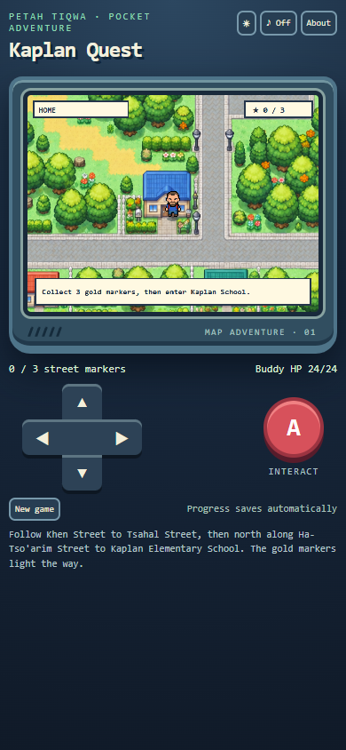

# GBA-Life: Kaplan Quest — Android prototype

[Download the signed APK](https://github.com/efremandrei/GBA-Life/releases/download/v0.1.0/KaplanQuest-v0.1.0.apk) · [Download the source ZIP](https://github.com/efremandrei/GBA-Life/releases/download/v0.1.0/KaplanQuest-source-v0.1.0.zip)

An offline, original handheld-style walking game for Android. The illustrated map interprets the supplied Petah Tiqwa route: Home near Khen Street, Tsahal Street, Ha-Tso'arim Street, and Kaplan Elementary School. It is not a precise street map. The player sprite retains the supplied bearded character's blue shirt and red backpack.

## Play

Install `KaplanQuest-v0.1.0.apk` on Android 8.0 or later. Tap **Start adventure**. Hold the D-pad to walk, collect three gold street markers, win the two original creature encounters, then press **A** at Kaplan School. Progress saves automatically; **Continue saved game** resumes it. The top sun/moon button switches between saved light and dark skins. Sound starts off.

This is a focused playable prototype. The exploration route, collision, directional avatar, touch controls, encounters, health, snacks, saving, and ending work. It does not include creature capture, a party system, multiple towns, or survey-accurate streets. No copyrighted Pokémon artwork or names are packaged in the app.

## Build

The project uses Java, Android Gradle Plugin 8.6.1, Gradle 8.7, and Android SDK 35. With `ANDROID_HOME` set, run `gradlew.bat assembleDebug` or `gradlew.bat assembleRelease` from this directory. The release build requires `keystore.properties` and `kaplan-quest.keystore` in this local directory. They are intentionally excluded from the source ZIP. Keep both files secure: future versions need the same key and an incremented `versionCode` for in-place updates.

Package ID: `com.efremandrei.kaplanquest`. Version: 0.1.0, build 1. The APK is universal and has no native CPU-specific libraries, so it can run on arm64 Samsung devices within the supported Android range.

## Validation

`smoke_test.cjs` uses `playwright-core` and local Chrome for a full keyboard route, both battles, save/resume, theme persistence, and victory at a phone-sized viewport. The APK was also built, installed, launched, and checked for touch movement on an Android emulator. Visual checks are saved as `preview_start.png`, `preview_battle_1.png`, `preview_battle_2.png`, `preview_win.png`, and `emulator_playing.png`.

Source art: `app/src/main/assets/gba_town_map.png` and `player_avatar_sprite_sheet.png` were generated for the earlier browser prototype from the user's supplied map and avatar references. The two encounter creatures and game code are original additions for this Android version.
