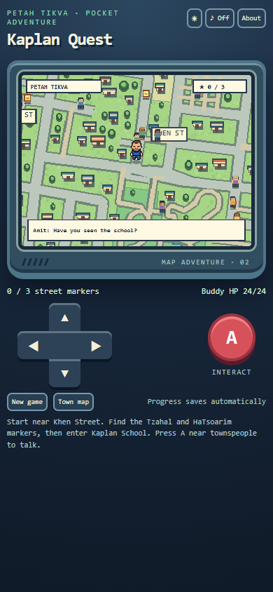

# GBA-Life: Kaplan Quest

[Download the signed Android APK](https://github.com/efremandrei/GBA-Life/releases/download/v0.2.0/KaplanQuest-v0.2.0.apk) · [Download the source ZIP](https://github.com/efremandrei/GBA-Life/releases/download/v0.2.0/KaplanQuest-source-v0.2.0.zip)

An offline, original pixel-art walking game for Android. Explore a stylized part of **Petah Tikva** with a street network based on real map data. Start near Khen Street, collect markers at Khen, Tzahal, and HaTsoarim streets, and reach Kaplan School. The map covers approximately **32.081–32.096° N, 34.858–34.889° E** around the school; it is a game map of this area, not the entire city or a navigation map. Buildings, parks, and characters are decorative interpretations.

## Map sources

The design was visually checked against [Google Maps near Kaplan School](https://www.google.com/maps/@32.0898811,34.8696697,16z) to confirm the relationships among Jabotinsky, Kaplan, HaTsoarim, Tzahal, and Khen streets. The reusable road and landmark geometry comes from [OpenStreetMap](https://www.openstreetmap.org/#map=16/32.0899/34.8697), downloaded through Overpass on 2026-10-03 and stored in `data/`. **© OpenStreetMap contributors**, available under the [Open Database License](https://www.openstreetmap.org/copyright). No Google map tiles or screenshots are included in the app.

Run `python scripts/build_town_map.py` with Pillow installed to regenerate the pixel map, collision data, and town geometry. It uses a fixed decorative scenery seed; new games generate new people separately. The supplied avatar's beard, blue shirt, and red backpack remain on the player sprite.

## Play

Install `KaplanQuest-v0.2.0.apk` on Android 8.0 or later. Use the D-pad to walk and **A** to speak with a nearby person or enter the school. On a computer, use arrow keys or WASD and E/Enter/Space. The **Town map** button shows your position, remaining markers, and school. Around 145 varied townspeople move along the street paths; each new game randomizes their looks, positions, and dialogue. Two original creature encounters guard route markers. Progress and the chosen light or dark skin save locally.

Version 0.2.0 keeps package ID `com.efremandrei.kaplanquest` and the original release signing key, increments `versionCode` to 2, and migrates 0.1.0 quest progress. Existing players are relocated to the new Khen Street starting point because the map coordinates changed. The APK has no native libraries and supports arm64 Samsung devices in the supported Android range.

## Build and checks

The project uses Java, Android Gradle Plugin 8.6.1, Gradle 8.7, and Android SDK 35. With `ANDROID_HOME` set, run `gradlew.bat assembleDebug` or `gradlew.bat assembleRelease`. A signed release requires private `keystore.properties` and `kaplan-quest.keystore` in the repository root; neither is in Git or the source ZIP. Preserve this key for install-in-place updates.

`smoke_test.cjs` uses Playwright and Chrome to check asset loading, walking, generated people, the town map, both encounters, save/resume, theme persistence, victory, and mobile-width layout. Run with `NODE_PATH` pointing to a `playwright-core` installation. Screenshots are in `docs/`.

The encounter creatures, scenery renderer, and game code are original. This project does not package Pokémon names or game artwork and does not yet include creature capture, a party system, or multiple towns.
