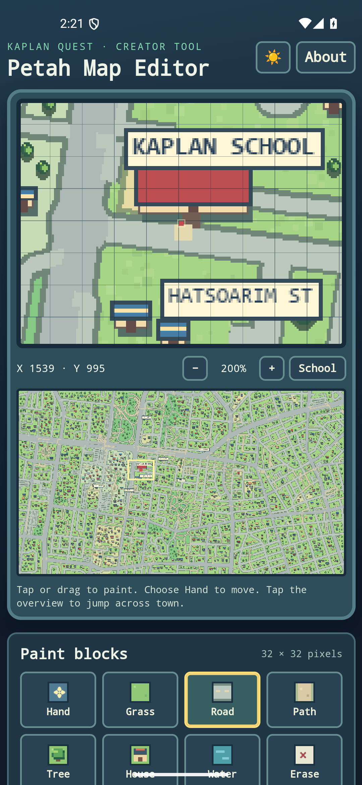

# GBA-Life: Kaplan Quest and Petah Map Editor

[Download Kaplan Quest v0.8.0](https://github.com/efremandrei/GBA-Life/releases/download/v0.8.0/KaplanQuest-v0.8.0.apk) · [Download Petah Map Editor v1.3.0](https://github.com/efremandrei/GBA-Life/releases/download/v0.6.0/PetahMapEditor-v1.3.0.apk) · [Download the source ZIP](https://github.com/efremandrei/GBA-Life/releases/download/v0.8.0/KaplanQuest-source-v0.8.0.zip)

[Splash screen](docs/preview_splash_v8.png) · [Character chooser](docs/preview_characters_v8.png) · [32-tile editor sidebar](docs/editor_sidebar_scrolled_v1.3.0.png) · [Updated town view](docs/preview_start_v6.png) · [Exit Game menu](docs/preview_exit_menu_v7.png) · [House interior](docs/preview_house_v6.png) · [City sprite sheet](art/town_sprite_sheet_city.png)

An offline, original pixel-art walking game for Android. Explore a stylized part of **Petah Tikva** with a street network based on real map data. Start near Khen Street, collect markers at Khen, Tzahal, and HaTsoarim streets, and reach Kaplan School. The map covers approximately **32.081–32.096° N, 34.858–34.889° E** around the school; it is a game map of this area, not the entire city or a navigation map. Buildings, parks, and characters are decorative interpretations.

## Map sources

The design was visually checked against [Google Maps near Kaplan School](https://www.google.com/maps/@32.0898811,34.8696697,16z) to confirm the relationships among Jabotinsky, Kaplan, HaTsoarim, Tzahal, and Khen streets. The reusable road and landmark geometry comes from [OpenStreetMap](https://www.openstreetmap.org/#map=16/32.0899/34.8697), downloaded through Overpass on 2026-10-03 and stored in `data/`. **© OpenStreetMap contributors**, available under the [Open Database License](https://www.openstreetmap.org/copyright). No Google map tiles or screenshots are included in the app.

Run `python scripts/prepare_tile_art.py` and `python scripts/build_town_map.py` with Pillow installed to regenerate the tile atlas, pixel map, collision data, and town geometry. The 16 original scenery tiles remain in [`art/town_sprite_sheet.png`](art/town_sprite_sheet.png). A matching 16-sprite companion, [`art/town_sprite_sheet_city.png`](art/town_sprite_sheet_city.png), adds sidewalk, crossing, high building, bus stop, light rail stop, car, bicycle, tram, slide, swings, gas station, shopping mall, hospital, city hall, traffic light, and bench. Its [generation prompt](art/city_sprite_prompt.md) records the exact grid order and style constraints. Both sheets feed a 32-tile atlas and the editor's grouped, scrollable palette. The map uses a fixed decorative scenery seed; new games generate new people separately. The supplied avatar's beard, blue shirt, and red backpack remain on the player sprite.

The launch flow has a branded splash screen and four playable character choices. Andrei is the original supplied avatar. Maya, Amir, and Dana are new four-direction pixel sprites; their [art prompts](art/character_sprite_prompts.md) describe the shared style and each design. The selected character is stored with progress, and older saves without a character selection use Andrei.

The refreshed base map adds walkable sidewalks and crossings, high buildings with rooms, roadside vehicles, playgrounds, and benches. Hospital sites and transit platforms come from the stored OpenStreetMap snapshot; the [NTA Red Line overview](https://www.nta.co.il/en/petah-tikva/) confirms the city's light rail context. Gas stations, shopping malls, and city hall are available in the editor palette for deliberate placement instead of being assigned invented locations. The base street network and quest destinations are unchanged.

## Play

Install `KaplanQuest-v0.8.0.apk` on Android 8.0 or later. After the splash, choose Andrei, Maya, Amir, or Dana, then tap **Start adventure**. **Continue saved game** restores the character used in that save. The town view fills most of a phone screen; the translucent D-pad and **A** button sit over its lower corners. Tap **Map** for the overview or **☰** for New game, Import, Original map, Sound, About, and **Exit Game**. New game opens character selection before replacing the current save. Exit Game saves the current position, quest, room, inventory, and battle before closing the Android app. The game also saves when it goes into the background. On a computer, use arrow keys or WASD and E/Enter/Space.

Approach a house entrance and press **A** to go inside. All 304 generated town houses, including the new high buildings, have a furnished room, with a bed that restores Buddy, a chest that can hold a snack, and furniture to examine. Press **A** at the door or use Android Back to leave. Houses placed with Petah Map Editor also open into rooms. Outside, **A** talks to townspeople and examines trees, flowers, lamps, street signs, transit stops, vehicles, playground equipment, hospitals, and the fountain. Around 145 varied townspeople move along the street paths; each new game randomizes their looks, positions, and dialogue. Two original creature encounters guard route markers. Progress, opened chests, the current room, and the chosen light or dark skin save locally.

Version 0.8.0 keeps package ID `com.efremandrei.kaplanquest` and the original release signing key, increments `versionCode` to 8, and preserves saves from earlier versions. Existing 0.1.0 players are relocated to the Khen Street starting point because the map coordinates changed. The APK has no native libraries and supports arm64 Samsung devices in the supported Android range.

## Edit the map in the separate app

1. Install `PetahMapEditor-v1.3.0.apk` alongside Kaplan Quest. It has its own launcher icon and package ID, `com.efremandrei.kaplanquest.editor`.
2. Scroll the grouped tile sidebar beside the map to choose from 32 terrain, nature, building, transit, and park tiles. Tap or drag over 32 × 32 pixel grid blocks. Select **Hand** to pan, use +/− to zoom, or tap the town overview to jump elsewhere.
3. Changes save automatically on that device. **Undo**, **Redo**, and **Clear edits** are available. The start, school, and marker paths are protected from blocking tiles.
4. Tap **Export map** and save `PetahTikva-Map.json` in Android's file picker. Open Kaplan Quest and tap **Import edited map**, then choose that file. **Original map** removes the imported overlay without deleting the JSON file or game progress.

The JSON is a compact list of changed blocks (`kaplan-grid-v1`). Each changed block is drawn over the original art; road, path, plaza, sidewalk, and crossing blocks become walkable, while grass and decorative blocks block walking. Place house or high-building blocks beside a walkable block to make their interiors reachable. The base street image remains available under the edits. The editor does not modify real map data or the rest of the city. The game checks that the starting point, school entrance, and three markers stay walkable when importing. Existing editor drafts and exported JSON files remain compatible.

The editor's local draft and the game's imported map are stored separately by Android. **Export the JSON file before moving to another device**; installing the editor does not transfer its draft into the game automatically.

## Build and checks

The project uses Java, Android Gradle Plugin 8.6.1, Gradle 8.7, and Android SDK 35. With `ANDROID_HOME` set, run `gradlew.bat :app:assembleRelease :editor:assembleRelease`. A signed release requires private `keystore.properties` and `kaplan-quest.keystore` in the repository root; neither is in Git or the source ZIP. Preserve this key for install-in-place updates to both apps. `scripts/build_town_map.py` regenerates and syncs the base map artwork and editor configuration.

`smoke_test.cjs` checks the splash, four character choices, chosen sprite persistence, phone layout, all house entrances, city interactions, Exit Game saving before Android closes, room persistence, and the game quest. `editor_smoke_test.cjs` checks the 32-tile scrollable side palette, paint/drag, undo/redo, editor persistence, JSON export/import, new crossing collision behavior, and mobile layout. Both use Playwright and Chrome with `NODE_PATH` pointing to a `playwright-core` installation. Android emulator screenshots are in `docs/`.

The encounter creatures, scenery renderer, and game code are original. This project does not package Pokémon names or game artwork and does not yet include creature capture, a party system, or multiple towns.
